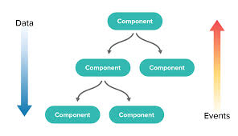

# React - kompozycja komponentów

Repozytorium przeznaczone do zajęć z React (kompozycja komponentów)  😎


# Prezentacja

Prezentacja na zajęciach nie będzie głównym narzędziem, jednak pare informacji będzie, którę mogą się przydać
[Prezentacja](https://docs.google.com/presentation/d/15AQg2peqZEe5YEAJf-CM1RrcsPyjGEOFHrcvScyjxss/edit?usp=sharing) 


--- 

# Najważniejsze informacje

## Rodzaje komponentów
### Komponent funkcyjny

- jest funkcją 😎
- **musimy** zaimportować `import React from 'react';` do pliku, aby go uzywać.
- **musi** zwracać JSX lub `null`
- mozna uzywać w nim hook'ów (o hook'ach jeszcze będzie)
- mogą mieć stan (przez hooki), od wersji 16.8 (o tym tez jeszcze będzie)
- mają cykl zycia (lifecycle), do którego mozna się podpiąć przez hook'i (o lifecycle równiez będzie)
- `props`'y mamy dostępne jako parametr funkcji

```jsx
const Component = props => {
  return (
    <div>
      <p>Hi {props.name}</p>
    </div>
  );
};
```

### Komponent klasowy

- jest klasą, która dziedziczy po `React.Component`
- **musi** mieć metodę `render`, która zwracać JSX lub `null`. Czyli to co chcemy wyrenderować
- **nie** mozna uzywać w nim hook'ów (o hook'ach jeszcze będzie)
- mogą mieć stan. Uzywamy do tego metod z klasy po której dziedziczymy - `React.Component` (o tym tez jeszcze będzie)
- mają cykl zycia (lifecycle), do którego mozna się podpiąć przez metody (o lifecycle równiez będzie)
- `props`'y mamy dostępne jako obiekt `props` w klasie. Czyli odwołujemy się przez `this.props`.

```jsx
class Component extends React.Component {
  // tu ląduje JSX, który chcemy wyrenderować
  // nazwa metody mówi sama za siebie 😉
  render() {
    return (
      <div>
        <p>Hi {this.props.name}</p>
      </div>
    );
  }
}
```

- [szybka ściągawka](https://guide.freecodecamp.org/react/functional-components-vs-class-components/)
- [cała prawda (uwaga - mozesz przeskoczyć narazie fragmenty o hook'ach)](https://overreacted.io/how-are-function-components-different-from-classes/)

---


## Props vs State

`Props`
- Dostępne w komponentach klasowych i funkcyjnych
- Są to dane przekazane z rodzica do dziecka
- Komponent nie może ich zmienić/nadpisać

`State`
- Dostępny tylko w komponentach klasowych*
- Są to dane komponentu
- Komponent może je modyfikować


*to nie do końca prawa, ale o tym będzię później  🤐 😯

## React data flow

React ma tzw. **jedno kierunkowy przepły danych (unidirectional data flow)** .

O co chodzi?

- Dane przepływają wyłącznie w dół. Od komponentów rodziców do dzieci. Przez propsy

```jsx
const Child = ({ someProp, objectProp }) => (
  <p>
    {someProp}, and value from object {objectProp.name}
  </p>
);

// tutaj `someProps` oraz `objectProp` to propsy które przenoszą dane
const Parent = () => (
  <Child someProp={"prop value 😎"} objectProp={{ name: "Here I am!" }} />
);
```

- Natomiast, jeśli chcemy "wypchnąć" dane do góry (do rodzica), przekazujemy event. A właściwie to callback, który zostanie wykonany w dziecku 😉

```jsx
const Child = ({ onClicked }) => {
  const handleClick = () => onClicked("🧒 says hello");

  return <button onClick={handleClick}>Click me!</button>;
};

// tutaj onClicked jest propsem, który "przenosi" event
const Parent = () => {
  const childClicked = text => alert(`Message from child: ${text}`);
  return <Child onClicked={childClicked} />;
};
```

Dobrze oddaje to ponizszy rysunek



---

## Stan komponentów 

W przypadku komponentu klasowego, mamy do dyspozycji pewien mechanizm, który umożliwia nam przechowywanie w ramach komponentu danych tymczasowych (dane są przechowywane dopóki komponent jest zamontowany)

Stan komponentu możemy zaincjalizować na dwa sposoby: 

Opcja bez użycia `constructor`
```jsx
import React from "react";

class App extends React.Component {
  state = {
    name: 'Jack',
    number: '123456',
  };
  
  render() {
    return (
      <div>Hello {this.state.name}</div>
    )  
  }
}
   
```

Opcja z użyciem `constructor`

```jsx
import React from "react";

class App extends React.Component {
  constructor(props) {
    super(props);

    this.state = {
      name: 'Jack',
      number: '123456',
    };
  }

  render() {
    return (
      <div>Hello {this.state.name}</div>
    )
  }
}

```

## Aktualizacja stanu komponentów

W odróżnieniu od `props`, stan możemy zmieniać w trakcie życia komponentu. Każda zmiana stanu powoduje ponowne wywołanie metody `render()` co skutkuje odświeżeniem komponentu (dzięki temu user widzi efekt zmiany na stronie)

Aby zaktualizować stan musimy wywołać metodę `setState()` w danym komponencie.
Jeżeli mamy komponent, który stan inicjalny ma w postaci:
```jsx
    state = {
        name: "Jack",
        number: '123456'
        age: 100
    }
```

i chcemy zmienić wybrane wartości stanu tego komponentu musimy wywołać metodę `setState` w taki sposób: 
```jsx
    // do metody setState przekazujemy obiekt z polami i wartościami jakie chcemy zmodyfikować w aktualnym stanie
    this.setState({
        name: "Nina",
        age: 90
    })
```

Zwóć uwagę, że do metody `setState` przekazaliśmy obiekt, który zawiera tylko 2 pola, a w naszym stanie mamy 3 pola. Dokładnie tak możemy zrobić, w tym przypadku pole `number` pozostanie bez zmian. 

Po wykonaniu powyższej metody `setState` nasz stan będzię wyglądał w taki sposób: 
```jsx
    state = {
        name: "Nina",
        number: '123456'
        age: 90
    }
```


---


## Formularze i elementy formularzy

Odczytywanie wartości, które wprowadził użytkownik jest ważną częścią większośći aplikacji.

W jaki sposób zapisywać w stanie komponentu wartość wprowadząną do inputa przez użytkownika? 

```jsx
import React from "react";
class InputComponent  extends React.Component {

  state = {
    //na start wartość inputa będzie pusta
    inputValue: ''
  };

  // metoda wywołuje się na kazdą zmiane w inpucie - czyli za kazdym wprowadzeniej nowej literki
  onInputChange = (e) => {
    this.setState({
      inputValue: e.target.value
    })
  };

  render() {
    return (
      <div>
        <input
          type="text"
          //wartość inputa jest pobierana ze stanu komponentu
          value={this.state.inputValue}
          onChange={this.onInputChange}
        />
      </div>
    )
  }
}

export default InputComponent;

```


---


## Cykl życia komponentu

Każdy komponent może być w określonym stanie w określonym czasie. 
Komponentu może na stronie nie być, może być widoczny, może być w trakcie montowania, może być zaktualizowany itp. 
Większość z tych momentów życia komponentu możemy jakby obserwować (to pewne uproszczenie) i podpinać swoje funkcjonalności, które zostaną wykonane w tych określonych momentach. [Więcej info](https://pl.reactjs.org/docs/state-and-lifecycle.html)

Dobrze obrazuje to ten wykres:


Na jego podstawie możemy wyodrębić 3 główne momenty w życiu komponentu: 

- Montowanie (mounting)
- Aktualizacja (updating)
- Odmontowywanie (usuwanie komponentu, unmounting)

#### Najczęściej stosowane metody

Najczęściej spotkamy się z metodami:
- `constructor(props)` - metoda zostanie wywołana przed zamontowaniem komponentu, tutaj możemy ustawić aktualny stan komponentu, 

- `componentDidMount()` - metoda zostanie wywołana po zamontowaniu obiektu, tutaj DOM powinien już zawierać nasz komponent i user powinien widzieć nasz komponent. Jeżeli komponent zawiera zagnieżdzone komponent, to one również zostały już wyrenderowane. 

- `componentDidUpdate(prevProps, prevState, snapshot)` -  metoda zostanie wywołana po każdej aktualizacji 
komponentu. Mamy w niej dostęp do poprzedniego stanu i poprzednich propsów.

- `componentWillUnmount()` - metoda zostanie wywołana na chwile przed usunięciem komponentu

- `shouldComponentUpdate(nextProps, nextState, nextContext)` - metoda zostanie wywołana za każdym razem przed aktualizacją komponentu. W tej metodzie możemy zatrzymać aktualizacje lub na nią zezwoliśc (zwracając `true` lub `false`)
- 


## Dodatkowe materiały
- [Lifting State Up](https://reactjs.org/docs/lifting-state-up.html)
- [Beware: React setState is asynchronous!](https://medium.com/@wereHamster/beware-react-setstate-is-asynchronous-ce87ef1a9cf3)
- [Index as a key is an anti-pattern](https://medium.com/@robinpokorny/index-as-a-key-is-an-anti-pattern-e0349aece318)


